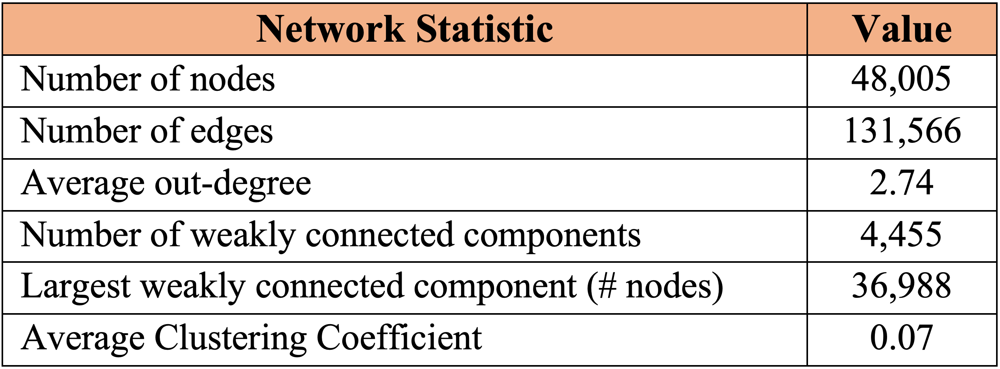

The dataset can be accessed by this link: https://ftp.fu-berlin.de/pub/misc/movies/database/frozendata/

# Project Description

In this project, the objective is to measure the success of a movie based on how much it has influenced other movies produced after its release. 

The task is to compare and contrast various ranking methods to quantify the influence of films based on the network of references among movies using graph centrality algorithms in Python. 

The dataset is the IMDb movie citation network consisting of around 48,000 international movies produced in several countries from 1920 to 2017. I apply the methods on a network with 48,000 nodes and 130,000 directed edges, where a node represents a movie, and edge exists between two movies if one of them cites the other. 

For each movie I also collect data on its year of release, genre and country of origin to analyze patterns in the film industry based on such features.

# Network Structure

Table 1 presents some statistics of the network that we have generated. The resulting network is directed and acyclic, because a film cannot be referenced by a film that came out at an earlier date.

*Table 1 – Generated network statistics*

# Methodology

As methodology, I compute an influence score for each movie through four static centrality measures and one temporal measure. These measures are graph centrality algorithms borrowed from Network Analysis. The methods selected for the final comparison are highlighted in bold.

## Temporal Measures

1. **Long-gap Citation Count** (Inspired by Wasserman et al. (2014))

## Centrality Measures

1. In-degree Centrality
2. Eigenvector Centrality
3. Katz Centrality
4. **PageRank Centrality**

## Results

### PageRank

*Table 2 – Top 10 most influential movies, by PageRank*

### Long-gap Citation Count

*Table 3 – Top 10 most influential movies, by Long Gap Citation Count*

<!-- Finally, I derive a list of films that can be considered the most influential in the history of cinema.  --> 

The main differences between the two tables are highlighted in  *blue*  and  *red*  in Table 2 and Table 3, respectively. Comparing two tables, I have several observations:

- First, there is temporal bias in Table 2. 70% of the movies have been released before 1940. This is expected; PageRank rewards older films than more recent films. As a result, older movies tend to place higher in the list.

- Second, the temporal bias is partially reduced in Table 3. This is due to the temporal nature of Long-Gap Citation Count, which excludes citatitons that are shorter than 25 years. As a result, there are more recent films in Table 3, such as movies highlighted in blue. 

- Third, movies highlighted in red in Table 2 are excluded in Table 3. This is because those films were influential soon after their original release but did not stand the test of time because they did not get referenced by more recent films.

- Finally, there is location bias. All movies in both tables are American with no other country represented. We can argue that the references that American movies receive are more accurately reflected in the dataset. 

### References

Wasserman, M., Zeng, X.H.T. & Amaral, L.A.N. 2014. “Cross-evaluation of metrics to estimate the significance of creative works”. Applied Mathematics. 112 (5) 1281-1286. 