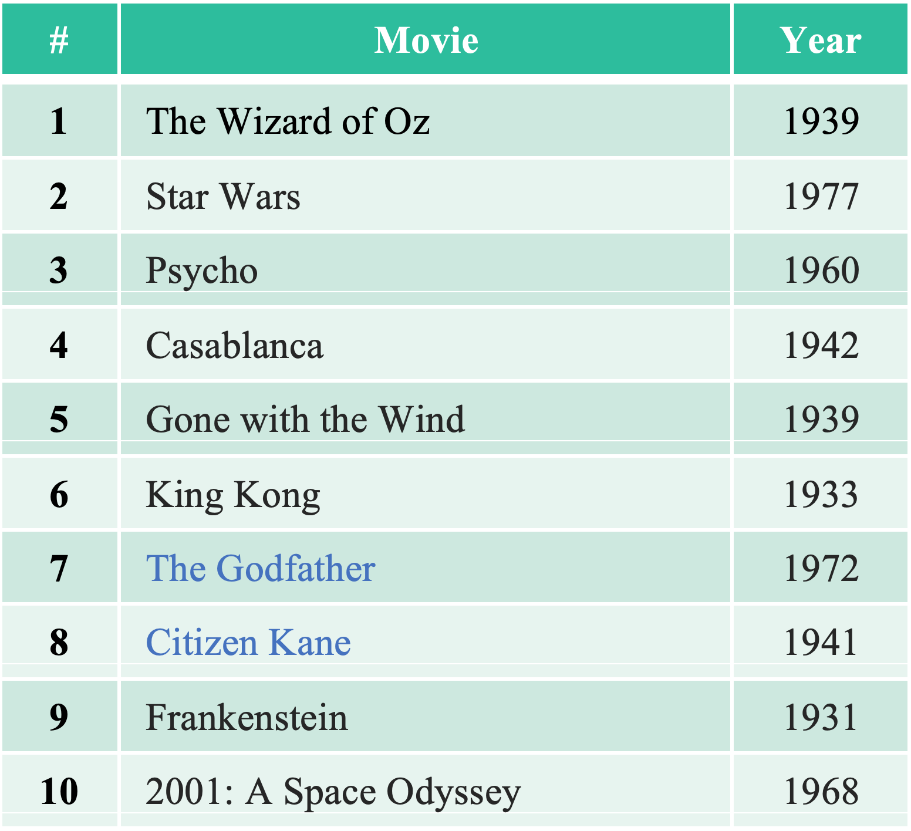
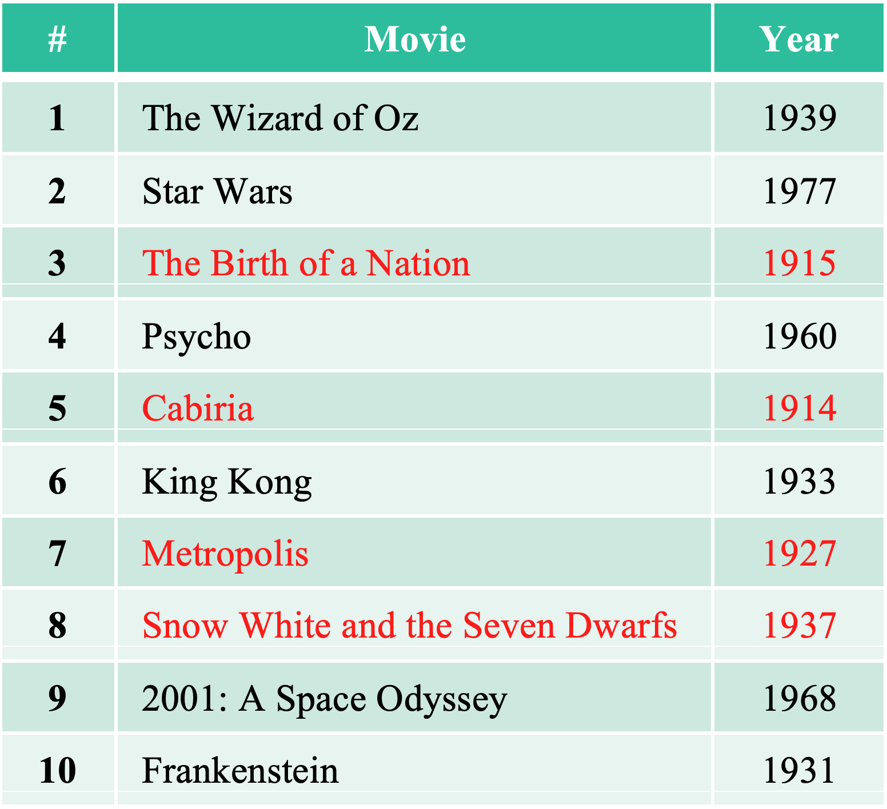

The dataset can be accessed by this link: https://ftp.fu-berlin.de/pub/misc/movies/database/frozendata/

# Project Description

In this project, the objective is to measure the success of a movie based on how much it has influenced other movies produced after its release. 

The task is to compare and contrast various ranking methods to quantify the influence of films based on the network of references among movies using graph centrality algorithms in Python. 

The dataset is the IMDb movie citation network consisting of around 48,000 international movies produced in several countries from 1920 to 2017. I apply the methods on a network with 48,000 nodes and 130,000 directed edges, where a node represents a movie, and edge exists between two movies if one of them cites the other. 

For each movie I also collect data on its year of release, genre and country of origin to analyze patterns in the film industry based on such features.

# Methodology

I compute an influence score for each movie through four static centrality measures and one temporal measure. These measures are graph centrality algorithms borrowed from Network Analysis.

## Temporal Measures

1. Long-gap Citation Count

## Centrality Measures

1. In-degree Centrality
2. Eigenvector Centrality
3. Katz Centrality
4. PageRank Centrality

## Results

### Long-gap Citation Count

*Table 1 – Top 10 most influential movies, by Long Gap Citation Count*

### PageRank

*Table 2 – Top 10 most influential movies, by PageRank*

<!-- Finally, I derive a list of films that can be considered the most influential in the history of cinema.  --> 
